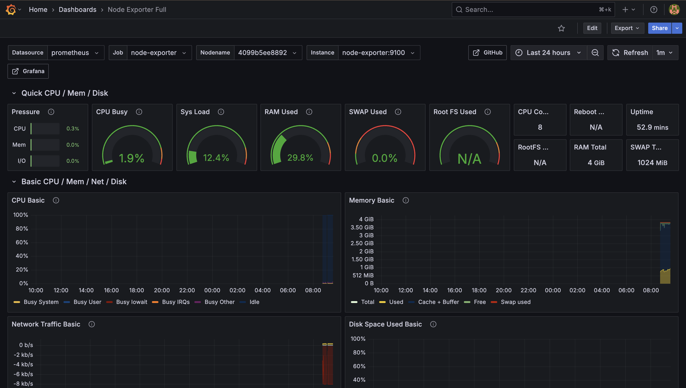
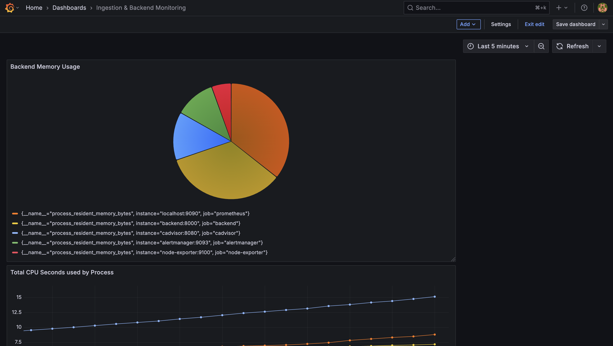
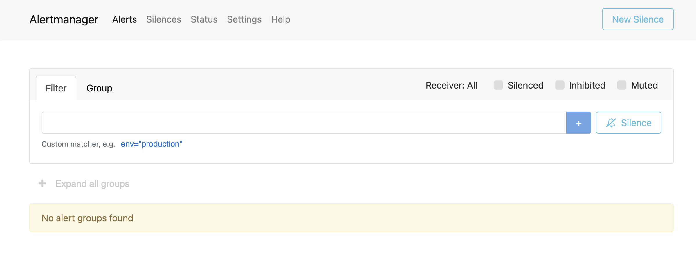
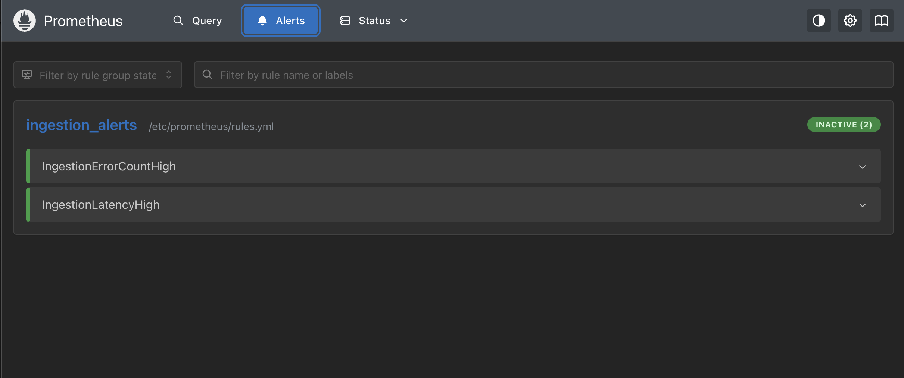
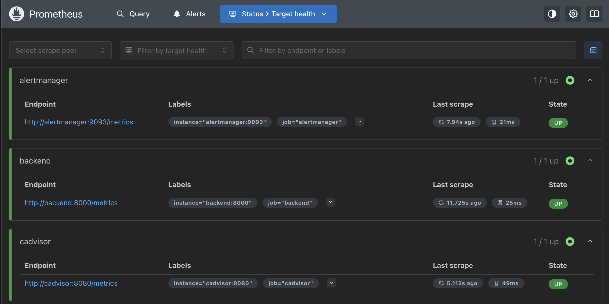

# Fitbit Data Pipeline with TimescaleDB

> **Note:**
> - **Task 0.a (Data Volume Estimation)** is documented in [`task_0.a.md`](./task_0.a.md).
> - **Task 0.b (Data Extraction)** was completed as part of the ingestion pipeline and is covered in the code and data processing sections below.

This project implements a daily, delta-load data pipeline that processes Fitbit data and stores it in a locally hosted TimescaleDB time-series database. The system uses Docker Compose to orchestrate the database and ingestion containers with automated daily data processing via cron.

## Architecture Overview

The system consists of four main components:

1. **TimescaleDB Container**: A PostgreSQL extension optimized for time-series data
2. **Ingestion Container**: Python application with cron scheduler for daily data processing
3. **Backend Container**: FastAPI application providing REST API endpoints
4. **Frontend Container**: React application with interactive dashboard and charts

## Task-by-Task Approach & Design Decisions

### Task 1: Ingestion / Write Flow
We use a Python ingestion script running in a Docker container, scheduled by cron to run daily. This script reads Fitbit data (CSV or API), processes it, and writes it into a TimescaleDB database. TimescaleDB was chosen for its time-series optimizations and easy integration with PostgreSQL tools. Docker Compose orchestrates both the database and ingestion containers, ensuring reliable, repeatable local deployment. Data is only ingested if it is new (delta loading), tracked by a `last_run.txt` file.

### Task 2: Access / Read Flow
A FastAPI backend provides REST endpoints for querying the time-series data. The backend connects directly to TimescaleDB and supports queries by user, metric, and date range, with optional granularity (raw, minute, hour, day). The frontend, built in React, lets users select participants, metrics, and time ranges, and visualizes the data in interactive charts. This separation of backend and frontend makes the system modular and easy to extend.

### Task 3: Optimizing for Multi-Year / Multi-User Queries
To keep queries fast as data grows, we use TimescaleDB's continuous aggregates to precompute summaries at different granularities (minute, hour, day). The backend automatically selects the right table or view based on the query's time span or requested granularity. This reduces the amount of raw data scanned for large queries, improving performance and scalability. The design also allows for future sharding or horizontal scaling if needed.

### Task 4: Dashboard for Analysis & Visualization
The React dashboard shows adherence, imputation, and participant metrics. Adherence is calculated as the percentage of time a device is worn, using heart rate data as a proxy. Imputation is handled by the backend, which can fill in missing data using linear interpolation and mark imputed points. The dashboard includes a 'contact by email' button for participants under certain thresholds; this works if email credentials are configured. The UI is kept simple and focused on usability for clinical trial managers.

### Task 5: Monitoring & Alerting
We use Prometheus to scrape metrics from the backend and system exporters (Node Exporter, cAdvisor). Grafana provides dashboards for both application and infrastructure metrics. Prometheus rules trigger alerts for ingestion errors and high latency, which are routed to Alertmanager for notifications (email setup required). All services are managed by Docker Compose for easy local deployment. This stack ensures the pipeline is observable and issues are caught early.

## Features

- **Delta Loading**: Only processes new data since the last run
- **Automated Scheduling**: Daily data ingestion at 1:00 AM via cron
- **Data Persistence**: TimescaleDB data persists across container restarts
- **Interactive Dashboard**: Modern React frontend with real-time data visualization
- **REST API**: FastAPI backend with comprehensive endpoints
- **Error Handling**: Robust error handling and logging
- **Multiple Data Types**: Supports activity, heart rate, SPO2, breathing rate, HRV, and active zone minutes

## TimescaleDB Advantages

TimescaleDB is a PostgreSQL extension specifically designed for time-series data, offering several key advantages:

### 1. **Hypertables for Time-Series Optimization**
- Automatically partitions data by time intervals
- Improves query performance for time-range queries
- Efficient data retention and compression policies

### 2. **SQL Compatibility**
- Full PostgreSQL SQL support
- Easy integration with existing PostgreSQL tools and ecosystems
- Familiar query syntax for developers

### 3. **Advanced Time-Series Functions**
- Built-in time-bucket functions for aggregations
- Continuous aggregates for pre-computed rollups
- Automatic data retention policies

### 4. **Scalability**
- Horizontal scaling through automatic partitioning
- Efficient handling of high-volume time-series data
- Optimized storage and compression

### 5. **Real-time Analytics**
- Fast queries on recent data
- Efficient joins with relational data
- Support for complex analytical queries

## Project Structure

```
.
├── docker-compose.yml          # Docker orchestration
├── Dockerfile                  # Ingestion container definition
├── entrypoint.sh              # Container startup script
├── init.sql                   # Database initialization
├── requirements.txt           # Python dependencies
├── README.md                  # This file
├── ingest/
│   ├── ingest.py             # Main ingestion script
│   └── data/                 # CSV data files
│       ├── activity.csv
│       ├── breathing_rate.csv
│       ├── heart_rate.csv
│       ├── spo2.csv
│       ├── hrv.csv
│       └── active_zone_minutes.csv
├── backend/
│   ├── Dockerfile            # Backend container definition
│   ├── requirements.txt      # Backend Python dependencies
│   └── app/                  # FastAPI application
│       ├── main.py           # Main FastAPI app
│       ├── core/             # Configuration
│       ├── db/               # Database utilities
│       ├── schemas/          # Pydantic schemas
│       └── hooks/            # Custom React hooks
├── frontend/
│   ├── Dockerfile            # Frontend container definition
│   ├── nginx.conf            # Nginx configuration
│   ├── package.json          # Node.js dependencies
│   └── src/                  # React application
│       ├── components/       # React components
│       ├── services/         # API services
│       ├── hooks/            # Custom hooks
│       └── types/            # TypeScript types
└── last_run.txt              # Tracks last ingestion timestamp
```

## Database Schema

### Raw Data Table
```sql
CREATE TABLE raw_data (
    id SERIAL,
    user_id INTEGER NOT NULL,
    timestamp TIMESTAMPTZ NOT NULL,
    metric_name VARCHAR(100) NOT NULL,
    value DOUBLE PRECISION NOT NULL,
    created_at TIMESTAMPTZ DEFAULT NOW()
);
```

### Hypertable Configuration
- **Partitioning**: By timestamp (automatic time-based partitioning)
- **Indexes**: Optimized for time-series queries
- **Constraints**: Prevents duplicate data entries

### Views
- **daily_metrics**: Daily aggregations of all metrics
- **latest_metrics**: Most recent value for each metric

## Setup Instructions

### Prerequisites
- Docker and Docker Compose installed
- Fitbit CSV data files in `ingest/data/` directory

### 1. Clone and Prepare
```bash
git clone <repository-url>
cd fitbit-data-pipeline
```

### 2. Add Data Files
Place your Fitbit CSV files in the `ingest/data/` directory:
- `activity.csv`
- `breathing_rate.csv`
- `heart_rate.csv`
- `spo2.csv`
- `hrv.csv`
- `active_zone_minutes.csv`

### 3. Start the Pipeline
```bash
# Build and start all services
docker-compose up -d

# View logs
docker-compose logs -f
```

### 4. Verify Setup
```bash
# Check container status
docker-compose ps

# Connect to database
docker exec -it fitbit_timescaledb psql -U postgres -d fitbit_data

# View ingested data
SELECT COUNT(*) FROM raw_data;
SELECT * FROM daily_metrics LIMIT 10;

# Access the dashboard
# Frontend: http://localhost:3000
# Backend API: http://localhost:8000
# API Documentation: http://localhost:8000/docs
```

## Configuration

### Environment Variables
The ingestion container uses these environment variables:
- `DB_HOST`: Database host (default: timescaledb)
- `DB_PORT`: Database port (default: 5432)
- `DB_NAME`: Database name (default: fitbit_data)
- `DB_USER`: Database user (default: postgres)
- `DB_PASS`: Database password (default: password)

### Cron Schedule
The default cron schedule runs daily at 1:00 AM:
```
0 1 * * * cd /app && python ingest/ingest.py >> /var/log/cron.log 2>&1
```

To modify the schedule, edit the Dockerfile or create a custom crontab file.

## Data Processing

### Supported Metrics
1. **Activity**: Daily activity levels
2. **Heart Rate**: Intraday heart rate measurements
3. **SPO2**: Blood oxygen saturation levels
4. **Breathing Rate**: Sleep breathing rate by stage
5. **HRV**: Heart rate variability data
6. **Active Zone Minutes**: Time spent in different activity zones

### Data Format Handling
The ingestion script handles various data formats:
- Simple CSV with dateTime and value columns
- Complex JSON-like strings with nested data structures
- np.float64() wrapped values
- Multiple data points per timestamp

## Monitoring and Logs

### View Cron Logs
```bash
docker exec fitbit_ingestion tail -f /var/log/cron.log
```

### Database Queries
```sql
-- Check recent data
SELECT * FROM raw_data 
WHERE timestamp > NOW() - INTERVAL '24 hours'
ORDER BY timestamp DESC;

-- Daily averages
SELECT * FROM daily_metrics 
WHERE date = CURRENT_DATE;

-- Metric counts
SELECT metric_name, COUNT(*) 
FROM raw_data 
GROUP BY metric_name;
```

## Troubleshooting

### Common Issues

1. **Database Connection Failed**
   - Check if TimescaleDB container is running: `docker-compose ps`
   - Verify network connectivity: `docker network ls`

2. **Data Not Ingesting**
   - Check cron logs: `docker exec fitbit_ingestion tail -f /var/log/cron.log`
   - Verify CSV file formats and locations
   - Check last_run.txt timestamp

3. **Permission Errors**
   - Ensure data files are readable: `chmod 644 ingest/data/*.csv`
   - Check container file permissions

### Manual Data Ingestion
```bash
# Run ingestion manually
docker exec fitbit_ingestion python ingest/ingest.py

# Reset last run timestamp
echo "2024-01-01T00:00:00" > last_run.txt
```

## Scaling and Production

### Performance Optimization
- Adjust TimescaleDB configuration for your data volume
- Implement data retention policies
- Use continuous aggregates for common queries

### Security Considerations
- Change default passwords
- Use secrets management for credentials
- Implement network security policies
- Regular security updates

### Backup Strategy
```bash
# Backup database
docker exec fitbit_timescaledb pg_dump -U postgres fitbit_data > backup.sql

# Restore database
docker exec -i fitbit_timescaledb psql -U postgres fitbit_data < backup.sql
```

## Task 5: Monitoring / Alerting

### Overview
This project implements a full local monitoring and alerting stack using Docker Compose. The stack provides observability for both the application (ingestion pipeline and backend API) and infrastructure (host and container metrics). It ensures failures or performance issues trigger notifications and enables real-time and historical monitoring via dashboards.

### Stack Components
- **Prometheus**: Scrapes and stores metrics from the backend, Node Exporter, and cAdvisor.
- **Grafana**: Visualizes metrics with pre-built and custom dashboards.
- **Alertmanager**: Handles alert notifications (email, etc.) based on Prometheus rules.
- **Node Exporter**: Collects host-level metrics (CPU, memory, disk, network).
- **cAdvisor**: Collects per-container resource usage metrics.
- **Backend**: Exposes custom application metrics (ingestion errors, latency, etc.) at `/metrics`.
- **Ingestion**: (Optional) Exposes metrics if running as a service; batch jobs are observable via backend metrics.

### How to Run the Stack
1. **Start all services:**
   ```sh
   docker-compose up -d --build
   ```
2. **Access dashboards and UIs:**
   - **Grafana:** [http://localhost:3001](http://localhost:3001) (login: `admin`/`admin`)
   - **Prometheus:** [http://localhost:9090](http://localhost:9090)
   - **Alertmanager:** [http://localhost:9093](http://localhost:9093)
   - **Backend metrics:** [http://localhost:8000/metrics](http://localhost:8000/metrics)
   - **cAdvisor metrics:** [http://localhost:8080/metrics](http://localhost:8080/metrics)

### Grafana Dashboards
- **Node Exporter Full (ID: 1860):** Host metrics (CPU, memory, disk, etc.)
- **Docker Monitoring (ID: 193):** Container metrics (may require query tweaks for your setup)
- **Custom Application Dashboard:**
  - Ingestion error count (`ingestion_error_count_total`)
  - Ingestion latency (average: `ingestion_latency_seconds_sum / ingestion_latency_seconds_count`)
  - Rows ingested per run (`ingestion_rows_total`)
  - (Optional) Backend CPU/memory usage

### Alerts
- **Prometheus rules** trigger alerts for:
  - Ingestion errors (`ingestion_error_count > 0`)
  - High ingestion latency (`ingestion_latency_seconds > 5`)
- **Alertmanager** is configured to send email notifications (fill in SMTP details in `alertmanager.yml`).
- Alerts are visible in Prometheus UI (`/alerts`) and Alertmanager UI. Alerts are inactive unless the condition is met.

### Interpreting Metrics and Alerts
- **ingestion_error_count_total:** Number of ingestion errors (should be 0 in normal operation).
- **ingestion_latency_seconds:** How long ingestion takes (track for spikes or slowdowns).
- **ingestion_rows_total:** Number of rows ingested in the last run (track for drops or spikes).
- **Node Exporter/cAdvisor metrics:** Monitor host/container health and resource usage.
- **Alerts:** If an alert fires, check the relevant dashboard and logs for root cause.

### Design Decisions & Tradeoffs
- **Docker Compose Networking:** All monitoring components are on a shared network, allowing service discovery by name (e.g., `prometheus:9090` in Grafana).
- **Prometheus as Central Collector:** All metrics are scraped by Prometheus, which is the single source of truth for dashboards and alerts.
- **Backend Instrumentation:** The backend exposes custom metrics for ingestion errors and latency, providing direct observability into pipeline health.
- **Ingestion Metrics:** The ingestion service is instrumented to expose metrics if run as a service. For batch jobs, backend metrics provide sufficient observability.
- **Alerting:** Prometheus rules and Alertmanager provide robust, modular alerting. Email notifications are supported (SMTP config required).
- **Grafana Dashboards:** Community dashboards are used for infrastructure; custom dashboards are created for application KPIs. Some cAdvisor dashboards may require query tweaks due to label differences.
- **Extensibility:** The stack is modular—components can be moved to separate hosts by updating scrape targets and service URLs.

### Optional/Advanced Steps
- **Grafana Alerts:** You can add Grafana-native alerts to panels for additional notification options.
- **API Request Metrics:** For more detailed API monitoring, add a Prometheus middleware to the backend.
- **Pushgateway:** For short-lived batch jobs, consider using Prometheus Pushgateway.

### Troubleshooting
- If a dashboard shows N/A, check the panel query and variable filters.
- If alerts are not firing, simulate an error or high latency to test.
- If email notifications are not received, verify SMTP settings in `alertmanager.yml`.

--- 

## Email Functionality Setup

To enable email notifications (e.g., contacting participants), you must configure Gmail SMTP credentials in the `backend` service section of `docker-compose.yml`:

```
MAIL_USERNAME: "your_gmail_address@gmail.com"
MAIL_PASSWORD: "your_gmail_app_password"
MAIL_SERVER: "smtp.gmail.com"
MAIL_FROM: "your_gmail_address@gmail.com"
MAIL_PORT: 587
MAIL_STARTTLS: "True"
MAIL_SSL_TLS: "False"
```

- By default, dummy values are provided. Replace them with your own Gmail address and an [App Password](https://support.google.com/accounts/answer/185833?hl=en) (not your normal Gmail password).
- After updating, restart the backend with:
  ```sh
  docker compose down
  docker compose up --build -d
  ```
- If you do not update these values, email functionality will not work, but the rest of the application will function normally. 

## Known Issue: Prometheus Target for Ingestion

> **Note:**
> On the Prometheus targets page, the ingestion service may appear as 'down' even though data ingestion works perfectly. This is a known issue related to how the ingestion container exposes its metrics endpoint and does not affect the actual ingestion pipeline. The ingestion job runs and loads data as expected, but Prometheus may not always be able to scrape its metrics endpoint reliably. This was not fully resolved before submission.

## Monitoring & Dashboard Screenshots

Below are example screenshots demonstrating the monitoring and alerting stack in action.

### Grafana Dashboards





### Alertmanager UI



### Prometheus Alerts



### Prometheus Targets



## Service URLs

- **Frontend:** [http://localhost:3000](http://localhost:3000)
- **Backend API Docs:** [http://localhost:8000/docs](http://localhost:8000/docs)
- **Grafana:** [http://localhost:3001](http://localhost:3001)
- **Prometheus:** [http://localhost:9090](http://localhost:9090)
- **Alertmanager:** [http://localhost:9093](http://localhost:9093)
- **cAdvisor:** [http://localhost:8080](http://localhost:8080)

## Contributing

1. Fork the repository
2. Create a feature branch
3. Make your changes
4. Add tests if applicable
5. Submit a pull request

## License

This project is licensed under the MIT License - see the LICENSE file for details. 

---